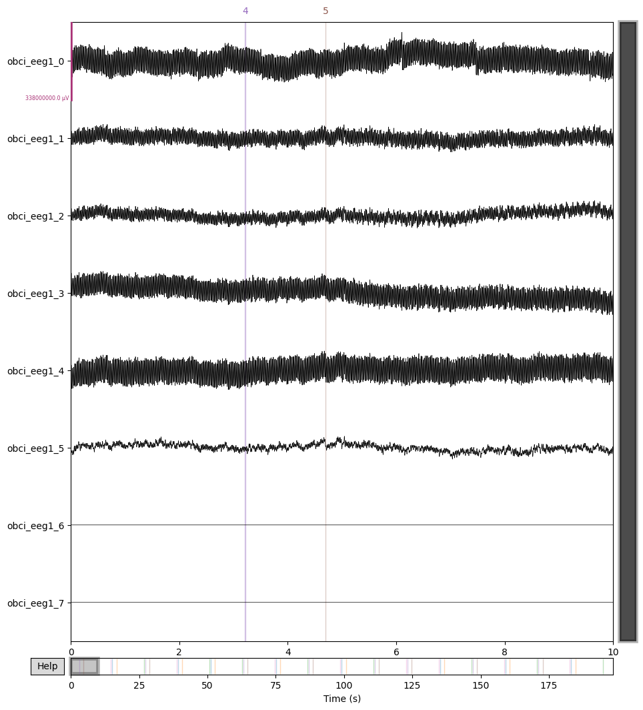
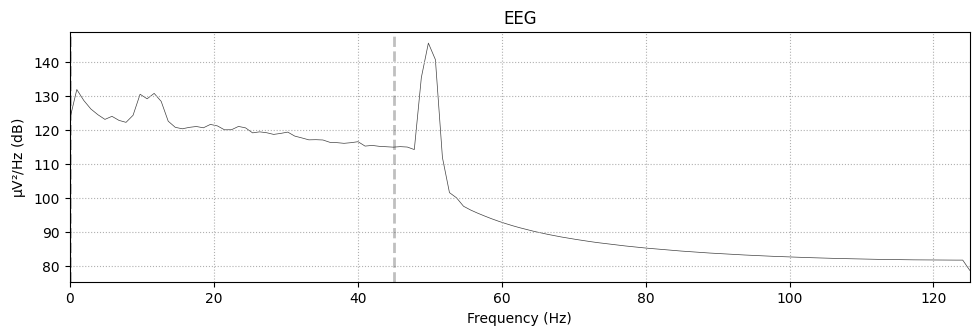
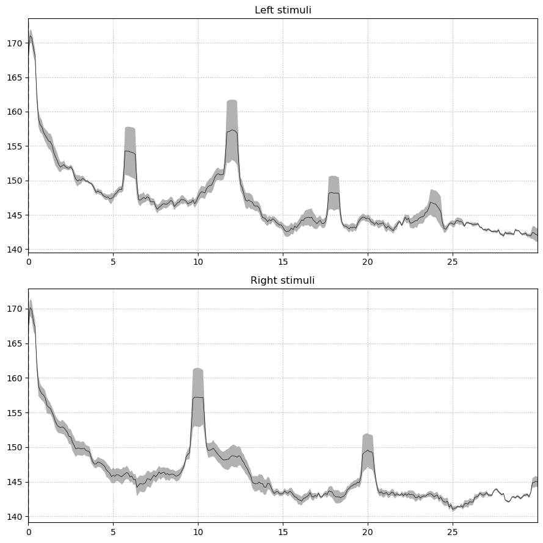
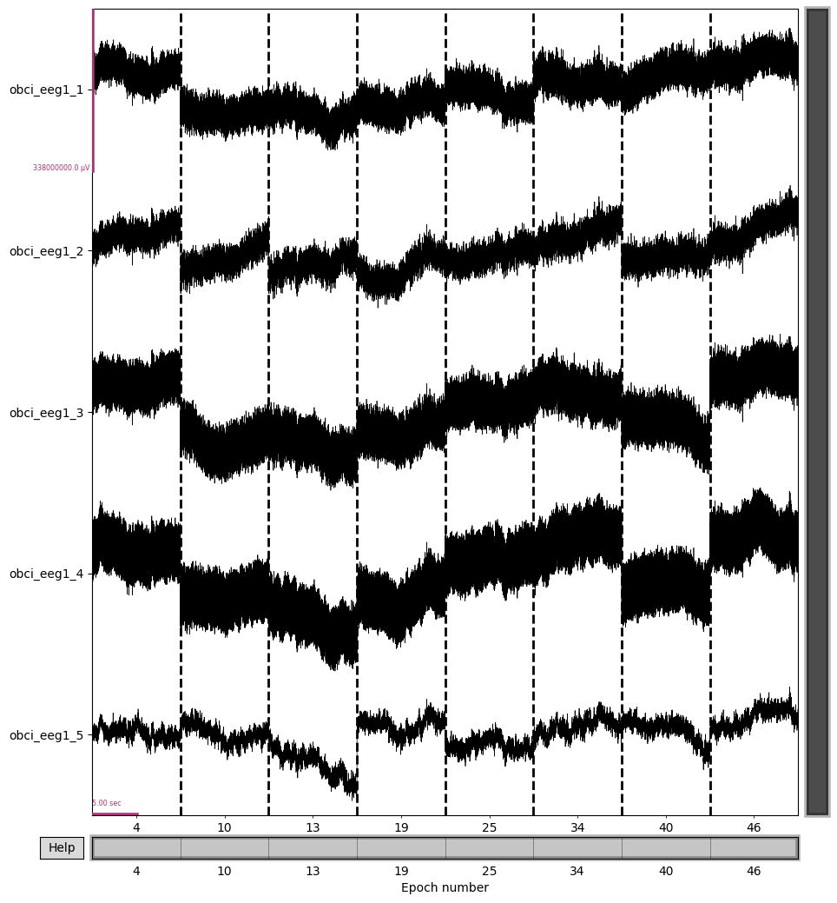
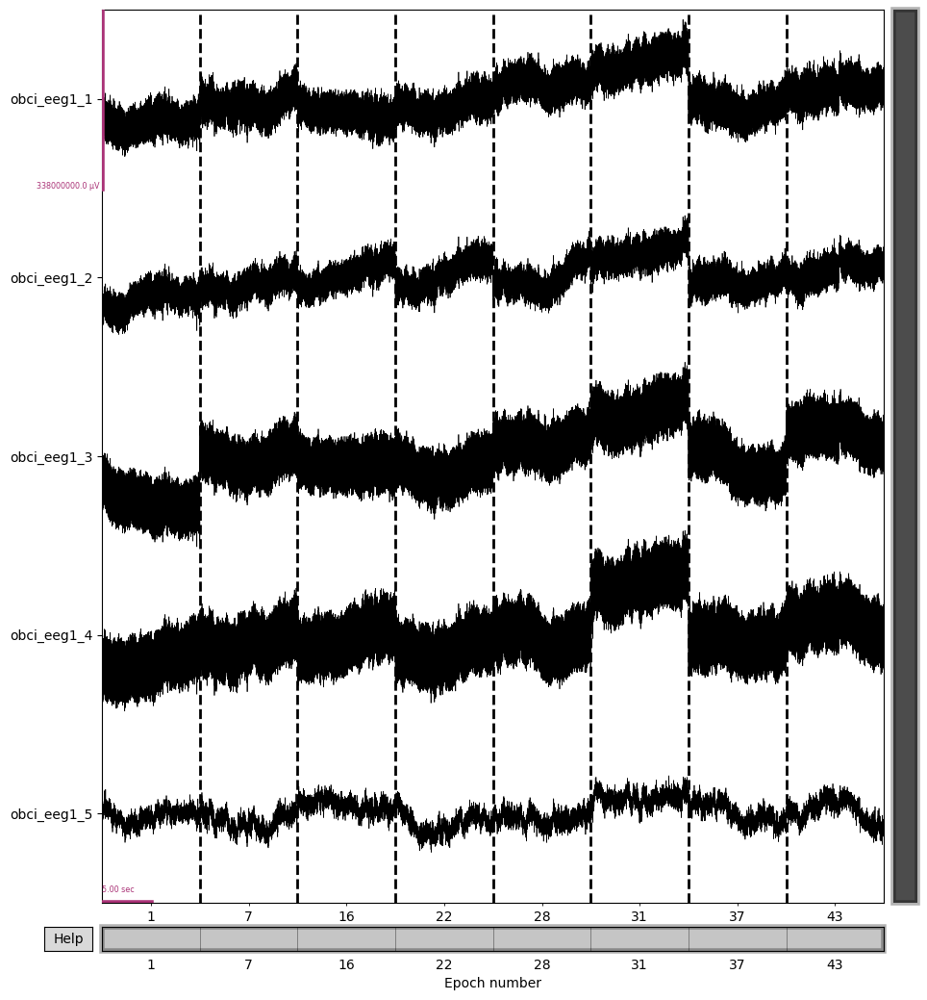
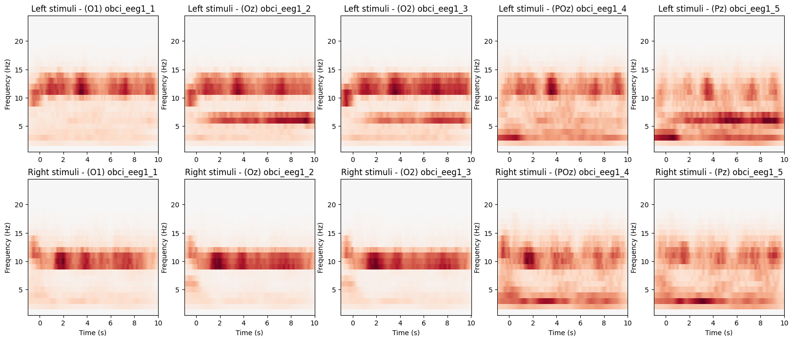

# 🧠Offline Analysis

This folder contains the following files:

1. **`utilities.py`**: This file stores functions that can be used for offline analysis, such as reading .XDF files, plotting visualizations, and conducting various analyses.

2. **`tutorial.ipynb`**: This Jupyter Notebook provides explanations for each function present in `utilities.py`. It serves as a guide to help you understand how each function works and provides instructions for customizing them according to your specific needs.

3. **`trainModel.ipynb`**: In this Jupyter Notebook, you can find code for reading epoch data stored in a CSV file, performing pre-processing steps, and training a model. It provides a workflow for training a model based on the processed data. - *In progress*


## Installation

Install with pip

```bash
pip install mne mnelab pyxdf matplotlib pandas numpy tensorflow
```
    


## Usage/Examples


### 1. Reading XDF file

```python
from utilities import read_xdf

filename = 'Pipo_1_5_test1.xdf'

# Loading XDF file into raw: MNE-RawArray
raw = read_xdf(filename, 

    bandpass=(3.0, 15.0), # Bandpass 3Hz - 15Hz (default 0Hz - 45Hz)

    show_plot=False, 
    # show_plot : If True, show all EEG channels and able to zoom in-out, scaling

    show_psd=False,
    # show_psd : If True, show overall average power spectral density
    )
```

#### show_plot
```python
raw = read_xdf(
    ...
    show_plot=True, 
    # show_plot : If True, show all EEG channels and able to zoom in-out, scaling
    ...
)
```


#### show_psd
```python
raw = read_xdf(
    ...
    show_psd=True, 
    # show_psd : If True, show overall average power spectral density
    ...
)
```



### 2. Offline analysis

```python
# Showing Power spectral density (PSD) split by Left-Right stimuli event
show_epoch(raw, filename,

    show_eeg=False,
    # show_eeg : If True, show all EEG channels and able to zoom in-out, scaling split by Left-Right stimuli

    show_time_freq=True
    # show_time_freq : If True, show Time-Frequency plot split by Left-Right stimuli and each O1, Oz, O2, POz, Pz
)
```


#### show_eeg
```python
show_epoch(
    ...
    show_eeg=True, 
    # show_eeg : If True, show all EEG channels and able to zoom in-out, scaling split by Left-Right stimuli
    ...
)
```



#### show_time_freq
```python
show_epoch(
    ...
    show_time_freq=True, 
    # show_time_freq : If True, show Time-Frequency plot split by Left-Right stimuli and each O1, Oz, O2, POz, Pz
    ...
)
```

